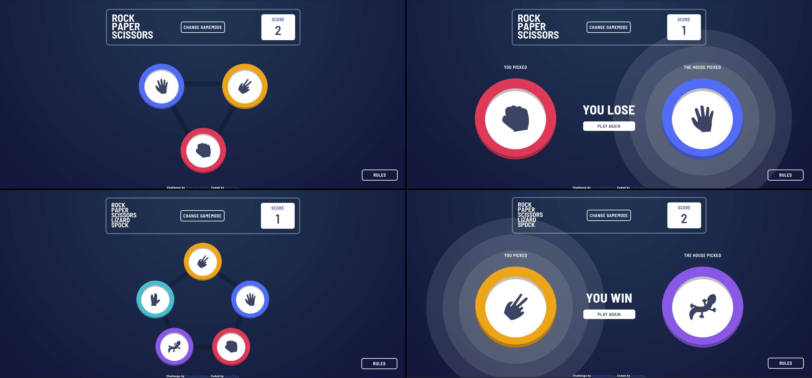

# Frontend Mentor - Rock, Paper, Scissors solution
This is a solution to the [Rock, Paper, Scissors challenge on Frontend Mentor](https://www.frontendmentor.io/challenges/rock-paper-scissors-game-pTgwgvgH).

## Overview

### The challenge
Users should be able to:

- View the optimal layout for the game depending on their device's screen size
- Play Rock, Paper, Scissors against the computer
- Maintain the state of the score after refreshing the browser _(optional)_
- **Bonus**: Play Rock, Paper, Scissors, Lizard, Spock against the computer _(optional)_

### Built with
- HTML5
- LESS
- JS (ECMAScript 2018)

### Links
- Solution URL: [https://github.com/Pasek108/FM-RockPaperScissors/](https://github.com/Pasek108/FM-RockPaperScissors/)
- Live Site URL: [https://pasek108.github.io/FM-RockPaperScissors/](https://pasek108.github.io/FM-RockPaperScissors/)

## Author
- Website - [Artur Pas](https://pas-artur.000webhostapp.com)
- Frontend Mentor - [@Pasek108](https://www.frontendmentor.io/profile/Pasek108)

<h1 align="center">FM-RockPaperScissors - Readme</h1>

  <strong>
    My solution to the <a href="https://www.frontendmentor.io/challenges/rock-paper-scissors-game-pTgwgvgH" target="_blank">Frontend Mentor "Rock, Paper, Scissors game" challenge</a>
  </strong>

  

 

> [!CAUTION]  
> <h4>Please, don't look at my solutions until you have completed it yourself.</h4>
> Challenges like these are an opportunity to improve by coming up with your own solutions. Take your time and think about your approach.  
> If you can't complete a challenge, skip it and come back to it later. Only look at someone else's solutions as a last resort, and treat it as a defeat.

 

# Table of Contents
* [FrontendMentor :thinking:](#frontendmentor-thinking)
  * [What is it](#what-is-it)
  * [Is it worth doing](#is-it-worth-doing)
* [Overview :sparkles:](#overview-sparkles)
  * [About](#about)
  * [Features](#features)
  * [Technologies](#technologies)
  * [Setup](#setup)
  * [Copyright](#copyright-copyright)
* [Details :scroll:](#details-scroll)
  * [User interface](#user-interface)
  * [Performance](#performance)

 

# FrontendMentor :thinking:

## What is it
[FrontendMentor](https://www.frontendmentor.io/home) is a platform that provides real-world front-end coding challenges to help developers improve their skills. It offers projects ranging from simple layouts to complex web applications, allowing users to practice HTML, CSS, and JavaScript by building solutions that closely resemble professional work.  

## Is it worth doing
Frontend Mentor is a great resource for developers looking to gain hands-on experience by working on practical projects. The challenges help reinforce best practices, improve design implementation skills, and build a portfolio. However, since there is no automated grading system, feedback depends on community reviews, making it essential to engage with others for constructive criticism.  

 

# Overview :sparkles:

## About
My solution to the [Frontend Mentor "Rock, Paper, Scissors game" challenge](https://www.frontendmentor.io/challenges/rock-paper-scissors-game-pTgwgvgH). This project was built using pure JavaScript and LESS. The logic part was fairly easy, but setting the pick options in a triangular and pentagonal shape was tricky.

Check out the [live version](https://pasek108.github.io/FM-RockPaperScissors/) of this project, as well as my [Frontend Mentor profile](https://www.frontendmentor.io/profile/Pasek108).

 

## Technologies
Languages:
- JavaScript
- HTML
- CSS

Libraries and frameworks:
- [LESS](https://lesscss.org)
- [GoogleFonts](https://fonts.google.com)
  
Programs:
- [VSCode](https://code.visualstudio.com)
- [Prepros](https://prepros.io)
- [PowerToys](https://learn.microsoft.com/en-us/windows/powertoys/)
- [ShareX](https://getsharex.com)
- [GIMP](https://www.gimp.org)

## Features
### Challenge requirements
- ✅ Optimal layout for the game depending on their device's screen size
- ✅ Play Rock, Paper, Scissors against the computer
- ✅ Maintain the state of the score after refreshing the browser _(optional)_
- ✅ **Bonus**: Play Rock, Paper, Scissors, Lizard, Spock against the computer _(optional)_

## Setup
- Use [live version](https://pasek108.github.io/FM-RockPaperScissors/).

- Download this repository and:
  - Open project in VSCode
  - Run [VSCode live server extension](https://marketplace.visualstudio.com/items?itemName=ritwickdey.LiveServer)
  - Or open project in Prepros

## Copyright :copyright:
I do not own the rights to the content of the challenges. All challenge data was downloaded and included only to provide context for the solutions.

 

# Details :scroll:

## User interface
### Rock paper scissors  
  
The header contains the logo on the left and buttons on the right.

---

### Rock paper scissors lizard spock
  
The header contains the logo on the left and buttons on the right.

---

### Result
  
The header contains the logo on the left and buttons on the right.

---

### Rules
  
The header contains the logo on the left and buttons on the right.

## Performance

### Desktop

### Mobile

